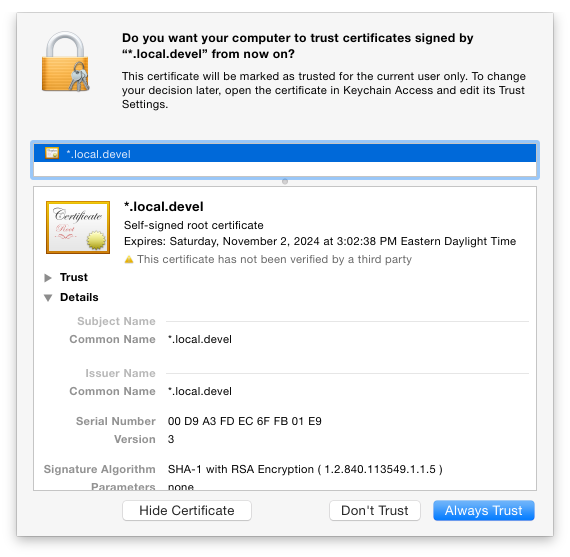
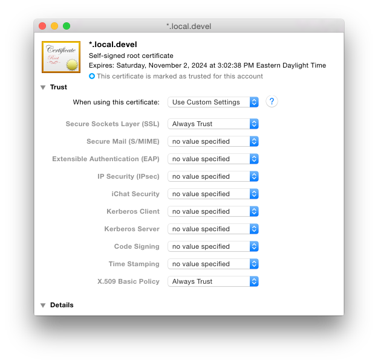

# The Setup for nginx

## The Goal

We want `nginx` to bind to our loopback interface and handle both HTTP and HTTPS
requests, without triggering the "make this seem really scary" feature of our
browsers designed to protect users from shady SSL certificates like ours. We
also want it to cleanly support these features for both `.devel` and `.staging`
TLDs for any number of apps, without requiring us to jump through unnecessary
hoops to get them going.

We are OK with having our various projects live in some kind of sensible
directory hierarchy, and not scattered all over our filesystem.

## The Install

    brew install nginx

You were expecting something else? Go ahead and symlink the `.plist` file as
instructed, but don't bother loading it yet, because we're going to make some
changes to its configuration first.

## The Configuration

We're going to replace the stock `nginx.conf` with one of our own. There are a
few placeholders in the configuration file, so we're going to replace them
using sed. Note that unless your name is Ernie and you store your projects in a
folder named Projects, you're probably going to want to change the second part
of this substitution:

    sed 's|<MY_PROJECT_ROOT>|/Users/ernie/Projects|g' nginx.conf > \
      /usr/local/etc/nginx/nginx.conf

Feel free to [read the comments](nginx.conf) in the configuration file for an
explanation of what we're up to.

We're also going to copy a couple of supporting files to our nginx configuration
directory:

    cp -r proxy_ports.conf ssl /usr/local/etc/nginx/

The `proxy_ports.conf` file has two maps in it for development and staging ports
by app, starting with port 3001 and 4001, respectively. 3000 and 4000 are set up
as the default port, so simple standalone apps won't need an entry. You might
want to take a look at this file, but we won't make any changes to it, yet.

## The SSL

When we run our apps in dev mode, it's common to disable things like forced SSL
redirection. This allows easy testing in development but also means one more
thing that differs between development and production. We're going to set up
nginx to handle SSL for us so that we don't have to disable features in dev
mode.

Open `/usr/local/etc/nginx/ssl/local.devel.openssl.cnf` in your text editor of
choice:

    mvim /usr/local/etc/nginx/ssl/local.devel.openssl.cnf

You'll notice that we have a "common name" set up as `*.local.devel`. We want to
create an SSL certificate that supports more than one hostname. In fact, if you
were wondering up to this point what exactly was up with `local.devel`, and why
we don't use just `devel`, it's because of SSL. Browsers don't generally allow
a wildcard component with just a TLD. They need a domain name, which is why
we need to use `*.local.devel`.

Because we're enabling v3 x509 extensions (via `x509_extensions = v3_req` in
this file), we can also set up "subject alternative names", which is just a
fancy way of saying "this certificate should support multiple domain names".

That being said, you'll want to customize the [alt_names] section to your taste.
At a minimum, we want to have `*.local.devel`, `local.devel`, `*.local.staging`,
and `local.staging` entries, to follow along with this guide. If you have some
SOA-style apps, or subdirectories in your project root, you'll want to configure
those here using numbered DNS entries. For example, the file included in this
repository has the following...

    DNS.5 = *.soa-app.devel
    DNS.6 = soa-app.devel
    DNS.7 = *.soa-app.staging
    DNS.8 = soa-app.staging

...which would work for apps in a `<my_project_root>/soa-app` subdirectory.

As of this writing, most of the browsers you probably care about don't support
multiple wildcard sections (such as `*.*.local.devel`), so if you have any apps
for which you need to support subdomains via SSL, you'll want to include them
here, as well. Putting it all together: if you have an app called "nifty-app" in
a subdirectory called "my-soa-app" and you needed to support subdomains, you'd
want to add:

    DNS.9 = *.nifty-app.my-soa-app.devel
    DNS.10 = *.nifty-app.my-soa-app.staging

This would allow the certificate to support those domain names without issue.

With our changes made, let's change into the nginx SSL directory...

    cd /usr/local/etc/nginx/ssl

...generate a private key...

    openssl genrsa 2048 > local.devel.key

...create a cert with our custom configuration file...

    openssl req -new -x509 -nodes -sha1 -days 3650 \
      -key local.devel.key -config local.devel.openssl.cnf > local.devel.cert

...capture the cert's info in a human readable form...

    openssl x509 -noout -fingerprint -text < local.devel.cert > local.devel.info

...and (finally!) create the `.pem` file that nginx needs...

    cat local.devel.cert local.devel.key > local.devel.pem

Wow. We should really wrap all of that up in a shell script or something.
Anyway, moving on, we only have one more thing to do: tell OS X that it should
trust our certificate for SSL and as a valid certificate authority. Still in
nginx's `ssl/` directory, type:

    open local.devel.pem

You should see something like the following:

Click "Always Trust". You'll be prompted for your password to update your
keychain. Once supplied, you'll see the newly-trusted certificate in the list,
with the name "*.local.devel". While the cert has now been trusted as a signer,
it's not been set up to be trusted for SSL. We'll do that next. Click on the
newly-trusted certificate. With the certificate open, expand the "Trust" secton,
and set "Secure Sockets Layer (SSL)" to "Always Trust". When finished, it should
look like this:

Close the window, supply your password one more time, and we're done setting up
nginx! You can finally run it:

    launchctl load ~/Library/LaunchAgents/homebrew.mxcl.nginx.plist

A `ps aux | grep nginx` should show a recently-started nginx master and worker
process. If it isn't recent, you may need to unload and then load the plist
again. If it doesn't show anything at all, take a look at
`/usr/local/var/log/nginx/error.log`, correct the error preventing nginx from
launching, and try again!

Now we're ready to move on to [configuring dnsmasq](../02_dnsmasq/)!
